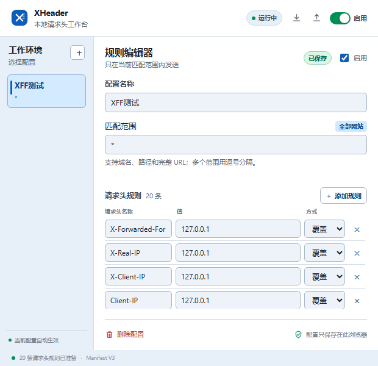

<div align="center">
  
  <h1>XHeader</h1>
  <p>本地优先的 Chrome 请求头工作台</p>
  <p>
    <kbd>Chrome Extension</kbd>
    <kbd>Manifest V3</kbd>
    <kbd>Local-first</kbd>
    <kbd>无远程脚本</kbd>
  </p>
</div>

<p align="center">
  
</p>

> 为接口联调、前端开发和经过授权的安全测试准备的轻量请求头工具。规则保存在本地，修改由 Chrome 规则引擎执行。

## ✦ 为什么是 XHeader

很多请求头调试工具功能强大，但配置复杂、权限边界不透明，或者依赖远程服务。XHeader 只专注于一件事：让你快速切换工作环境，并清楚地知道哪些请求头会作用于哪些范围。

## 🧩 功能一览

| 能力 | 说明 |
| --- | --- |
| 🗂️ 工作环境 | 使用多个配置文件管理开发、测试、预发布等场景 |
| 🎯 匹配范围 | 支持域名、路径、完整 URL，或使用 `*` 匹配全部网站 |
| 🧱 请求头规则 | 支持覆盖、追加和删除三种操作 |
| ⏻ 启停控制 | 可暂停全部规则，也可以单独暂停当前环境 |
| ⇅ 配置迁移 | 使用 JSON 文件导入和导出配置 |
| 🖥️ 稳定布局 | 左侧环境栏固定，右侧规则区独立滚动 |
| 🛡️ 本地优先 | 配置保存在浏览器本地，不连接第三方服务 |

## 🚀 安装

1. 下载或克隆本项目。
2. 打开 Chrome：`chrome://extensions`。
3. 开启右上角的“开发者模式”。
4. 点击“加载已解压的扩展程序”。
5. 选择本项目根目录。
6. 点击工具栏中的 XHeader 图标。

代码更新后，在扩展管理页点击 XHeader 的“重新加载”即可。

## 🛠️ 快速使用

### 创建一个工作环境

在左侧“工作环境”栏点击 `＋`，然后填写：

- **配置名称**：例如 `测试环境`、`开发环境`。
- **匹配范围**：例如 `example.com`、`localhost` 或 `*`。
- **请求头名称和值**：例如 `X-Debug-Mode: true`。

多个匹配范围使用逗号分隔：

```text
example.com, api.example.com, localhost
```

### 三种规则方式

| 方式 | 行为 |
| --- | --- |
| `覆盖` | 设置请求头的新值，已有同名 Header 时替换 |
| `追加` | 在请求中追加指定值 |
| `删除` | 删除指定请求头，不需要填写值 |

配置修改后会自动保存，并同步到 Chrome 的动态规则引擎。

## 🧪 默认 XFF 测试环境

首次安装后会自动创建 `XFF测试` 配置：

```text
匹配范围：*
参数值：127.0.0.1
规则数量：20 条
```

包含的常见代理来源 Header：

<details>
<summary>展开查看完整列表</summary>

```text
X-Forwarded-For
X-Real-IP
X-Client-IP
Client-IP
True-Client-IP
CF-Connecting-IP
X-Cluster-Client-IP
X-Original-Forwarded-For
Forwarded
X-Forwarded
Forwarded-For
X-Forwarded-For-Original
X-Original-Client-IP
X-Original-Remote-Addr
X-Remote-IP
X-Remote-Addr
X-ProxyUser-Ip
WL-Proxy-Client-IP
Proxy-Client-IP
Fastly-Client-IP
```

</details>

不同服务对代理来源 Header 的识别方式不同，请根据目标服务的实际实现选择和调整字段。仅应在你拥有权限的系统和测试环境中使用。

## 🔐 安全与隐私

| 项目 | XHeader 的行为 |
| --- | --- |
| 配置存储 | 仅使用 Chrome `chrome.storage.local` |
| 规则执行 | 使用 `declarativeNetRequest`，由浏览器处理 |
| 页面内容 | 不读取网页正文、表单内容或页面脚本 |
| 远程代码 | 没有远程 JavaScript、远程配置或动态执行 |
| 外部服务 | 没有登录、埋点、分析服务或外部 API |

### 权限说明

- `storage`：保存本地配置。
- `declarativeNetRequestWithHostAccess`：应用请求头修改规则。
- `<all_urls>`：允许用户将规则应用到自己配置的任意网站。

`<all_urls>` 具有较大的主机访问范围，建议只从可信来源安装，并在不需要时关闭全局规则或暂停扩展。

## 📁 项目结构

```text
XHeader/
├── manifest.json       # Chrome 扩展清单
├── background.js       # 动态请求头规则同步
├── popup.html          # 弹窗结构
├── popup.css           # 弹窗样式
├── popup.js            # 配置编辑与交互逻辑
├── icons/              # Chrome 扩展图标资源
├── img/                # README 截图与 GitHub 展示图片
├── README.md           # 项目说明
├── PRODUCT.md          # 产品定位
└── DESIGN.md           # 界面设计说明
```

## 🧭 当前限制

当前版本主要处理请求头，暂不支持：

- 响应头修改
- 按标签页临时启用
- 规则分组和批量编辑
- 在线同步配置
- 自动生成发布压缩包

## 🔧 开发说明

项目使用原生 HTML、CSS 和 JavaScript，没有构建步骤，也没有第三方运行时依赖。修改代码后直接在 Chrome 扩展管理页重新加载即可。

```powershell
node --check popup.js
node --check background.js
```

## ⚠️ 免责声明

本项目仅用于开发调试、接口联调和经过授权的安全测试。使用者应确保对目标网站、接口或系统拥有明确的测试授权，并自行承担使用本工具产生的责任。

<div align="center">
  <sub>Made for clear, local request debugging.</sub>
</div>
